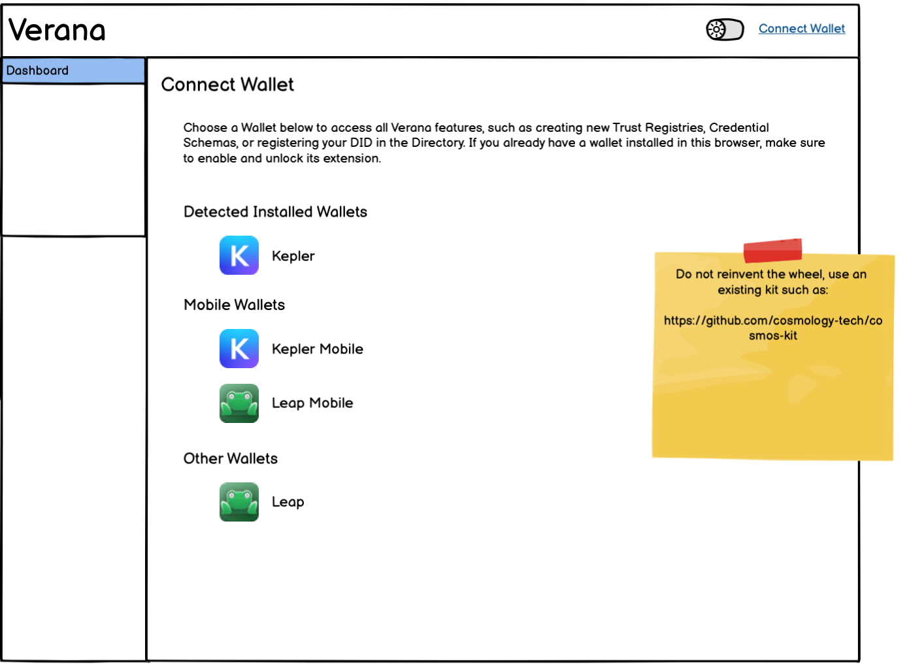

# Verana App Specification

**Specification Status:** Pre-Draft

**Latest Draft:** [verana-labs/verana-app-spec](https://github.com/verana-labs/verana-app-spec)

**Editors:**

~ [Fabrice Rochette](https://www.linkedin.com/in/fabricerochette) (The Verana Foundation, 2060.io)

<!-- -->

**Participate:**

~ [GitHub repo](https://github.com/verana-labs/verana-app-spec)

~ [File a bug](https://github.com/verana-labs/verana-app-spec/issues)

~ [Commit history](https://github.com/verana-labs/verana-app-spec/commits/main)

---

## About this Document

This specification is for the Verana Network frontend, a container-based App easily deployable locally, or in any modern cloud infrastructure.

## Introduction

The Verana App provides:

- interaction with the verana network, by querying the ledger and post transactions;
- statistics (ecosystem, blockchain, DTSs).

## Terminology

TBW

## Specification

### [GENERAL] General

The Verana App MUST be delivered as a container.

#### [GENERAL-DEPLOYMENT] General - Deployment

- [GENERAL-DEPLOYMENT-HUB] Container MUST be versioned and deployed to docker hub.
- [GENERAL-DEPLOYMENT-DOCKER] Documentation for running the container with docker MUST be provided.
- [GENERAL-DEPLOYMENT-KUBE] Documentation for deploying the container in Kubernetes MUST be provided.
- [GENERAL-DEPLOYMENT-HELM] Verana App MUST be installable in Kubernetes by using helm install. Documentation MUST be provided.
- [GENERAL-DEPLOYMENT-LAMBDA] Verana App MUST be runnable in Amazon Lambda. Documentation MUST be provided.

#### [GENERAL-ENV] General - Container Variables

| Type                           |Variable                               | Description                    | Default Value (if unspecified)                    |
|--------------------------------|---------------------------------------|----------------------------------|----------------------------------|
| General                        | APP_NAME                              |                                  | Veranito                         |
|                                | APP_LOGO                              |                                  | logo.svg                        |
|                                | ADDRESS_EXPLORER                      |                                  | https://www.mintscan.io/verana/address/VERANA_ADDRESS   |
| Network Configuration          | MAINNET_API_ENDPOINT                  |                                  | https://api.verana.network       |
|                                | MAINNET_RPC_ENDPOINT                  |                                  | https://rpc.verana.network       |
|                                | MAINNET_IDX_ENDPOINT                  |                                  | https://idx.verana.network       |
|                                | MAINNET_CHAIN_ID                      |                                  | vna-mainnet-1       |
|                                | TESTNET_API_ENDPOINT                  |                                  | https://api.testnet.verana.network       |
|                                | TESTNET_RPC_ENDPOINT                  |                                  | https://rpc.testnet.verana.network       |
|                                | TESTNET_IDX_ENDPOINT                  |                                  | https://idx.testnet.verana.network       |
|                                | TESTNET_CHAIN_ID                      |                                  | vna-testnet-1       |
|                                | DEVNET_API_ENDPOINT                   |                                  | https://api.vna-devnet-main.devnet.verana.network       |
|                                | DEVNET_RPC_ENDPOINT                   |                                  | https://rpc.vna-devnet-main.devnet.verana.network       |
|                                | DEVNET_IDX_ENDPOINT                   |                                  | https://idx.vna-devnet-main.devnet.verana.network       |
|                                | DEVNET_CHAIN_ID                       |                                  | vna-devnet-main       |
|                                | DEFAULT_NETWORK                       |   Default selected network in App    | vna-mainnet-1       |
| Internationalization           | DEFAULT_LOCALE                        |   Failover locale | en_US       |
|                                | SUPPORTED_LOCALES                     |                                  | en_US, fr_FR, en:en_US, fr:fr_FR       |
| Top-up my VNA account          | VNA-TOPUP-VS                          |   List of VSs for top-up         | did:example:123, did:example:456       |

#### [GENERAL-SETTINGS] General - Settings

All settings MUST be persisted in browser session.

[GENERAL-SETTINGS-NETWORK-DEFAULT] When a new session is created, default selected network MUST be set to `DEFAULT_NETWORK`.

[GENERAL-SETTINGS-NETWORK-MANAGE] In Settings/Network, user can see pre-configured networks and their endpoints (Mainnet, Testnet, Devnet). Additionally, user CAN add custom networks and save. Custom networks MUST be persisted in session.

[GENERAL-SETTINGS-NETWORK-SELECT] User CAN select a network. Network list MUST show Mainnet, Testnet, Devnet, and custom networks.

[GENERAL-SETTINGS-NETWORK-SELECTED] If selected network is not Mainnet, its name MUST appear in App header.

[GENERAL-SETTINGS-LOCALE-SELECT] Default to user agent presented locale "Browser Default" which sets `settings.locale` to  NULL (undefined). User can force a locale here and store it to `settings.locale`. Locale list MUST contain all supported locales.

#### [GENERAL-I18N] General - Internationalization

[GENERAL-I18N-DEFAULT]

[GENERAL-I18N-LOCALE-DATA] All texts, labels, rollover texts, images with texts, videos, sounds, text icons MUST be centralized in a directory per locale

[GENERAL-I18N-CONTENT-KEY] Each content MUST be identified by its key, `content_key`.

[GENERAL-I18N-RENDER-CONTENT] Render content from `content_key`:

Get `locale` from `settings.locale` from user settings. If null, use `locale` from user agent.

- find content with its `content_key` for locale `locale`
- if not found, try to use the default locale for the same language. So if `locale` is equal to `en_GB`, look for entry en:... in `SUPPORTED_LOCALES` to get default locale for `en`.
- else fallback to `DEFAULT_LOCALE` (normally `en_US`).

:::Note
At least the content of the default locale MUST be provided by development/design team.
Default locale for development MUST be en_US.
:::

:::Warn
Right to left text (like Arabic) MUST be supported.
:::

#### [GENERAL-LAYOUT] General - Layout

[GENERAL-LAYOUT-RESPONSIVE] App MUST be usable from any device, layout MUST be responsive.

[GENERAL-LAYOUT-HEADER] Header MUST include a squared App logo and App name on the left side, and on the right side the setting icon, a dark/light mode, and a crypto account zone. Optionally, if layout is very small, a Menu hamburger icon CAN appear on te left side of the header, and the App name MAY disappear.

##### Header - Not Connected

##### Header - Connected

##### Header - Crypto account details

[GENERAL-LAYOUT-MENU] On the left size, a menu. When size of window is small, menu is hidden and a hamburger icon appears for showing the menu.

[GENERAL-LAYOUT-MENU-NORMAL]

[GENERAL-LAYOUT-MENU-SMALL]

[GENERAL-LAYOUT-MENU-SMALL-OPENED]

[GENERAL-LAYOUT-CONTENT] The content zone.

### Crypto Wallet Integration

#### [CW-GENERAL]

[CW-GENERAL-KIT] Use a kit such as the [cosmos-kit repo](https://github.com/cosmology-tech/cosmos-kit) to easily integrate any wallet to the Verana App.

 If user reaches the App through any URL of the App, and if a detected installed wallet is found and it has been already granted, App MUST connect to it immediately with no user intervention. (same will happen if I am connected and I reload the page in my browser).

#### [CW-CONNECT-WALLET]

- read the doc of cosmos-kit or any other library you want to use
- detect any installed wallet extension, and put them in the "Detected Installed Wallets" section.
- show available mobile wallets, in the "Mobile Wallets" section
- show available non mobile wallets not detected, in the "Other Wallets" section

#### [CW-CONNECT-WALLET-EXT]

Follow kit instructions and be inventive. Example mockup:

#### [CW-CONNECT-WALLET-MOB]

Follow kit instructions and be inventive. Example mockup:

#### [CW-CONNECT-WALLET-CONNECTED]

Redirect user to where he was before connecting.

### [ACCOUNT] Account

Account shows balances:

- Main balance
- Trust Deposit balance

and 3 use cases:

- Main Balance > get VNA: to top-up crypto account main balance.
- Trust Deposit > claim interests: to collect my Trust Deposit interests and receive them in my main balance. Use [MOD-TD-MSG-2] from verifiable-trust-vpr-spec.
- Trust Deposit > reclaim deposit: to get back claimable deposit, if any. Use [MOD-TD-MSG-3] from verifiable-trust-vpr-spec.

#### [ACCOUNT-GET-VNA]

Present a list of services to top-up my verana account.

The list of the services is configurable in variable `VNA-TOPUP-VS`. Use this list of service to generate a radio button type select. Selected Verifiable Service MUST be trust resolved to get service name (service credential) and organization name (organization credential) shown in service description text, and MUST show a QR code for connecting to it and passing the vna account address as a parameter. User then scans the service with Hologram and follow instructions to top-up his/her account.

For now, ignore the credit card icon. We'll later find a declarative way in service credential(s) to show accepted payment methods.

#### [ACCOUNT-TD-CLAIM-INTERESTS]

If interests are available, user sees the text and the cancel / confirm buttons like in mockup. Else, show text "You do not have interests to claim yet." with no buttons.

#### [ACCOUNT-TD-RECLAIM]

If reclaimable trust deposit is not equal to 0, user sees the text, confirm check, and the cancel / confirm buttons like in mockup. Else, show text "You do not have reclaimable trust deposit." with no check box and no buttons.

### DID Directory

#### List my entries

#### Add a DID

#### Renew a DID

#### Touch a DID

#### Remove a DID